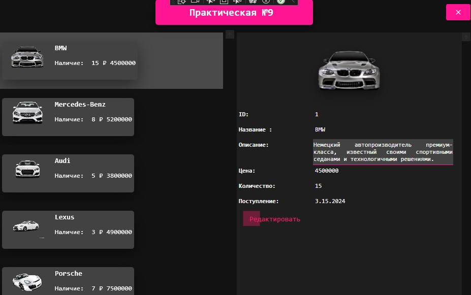
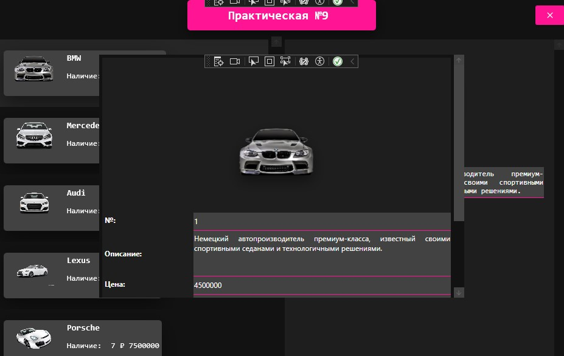

<h1>Практическая работа №9</h1>
<h2>Управление товарами с использованием паттерна MVVM</h2>

<h3>Описание проекта</h3>

WPF-приложение для управления товарами с использованием паттерна MVVM (Model-View-ViewModel).

<h3>Основные функции</h3>
<ul>
    <li>Просмотр списка товаров</li>
    <li>Редактирование данных о товарах</li>
    <li>Удаление товаров из каталога</li>
</ul>

<h3>Как запустить</h3>
<ol>
    <li>Откройте исполняемый файл приложения</li>
    <li>Начните работу с товарами</li>
</ol>

<h3>Скриншоты приложения</h3>

<table border="1">
    <tr>
        <th>Главное окно</th>
        <th>Редактирование</th>
    </tr>
    <tr>
        <td align="center"></td>
        <td align="center"></td>
    </tr>
</table>
